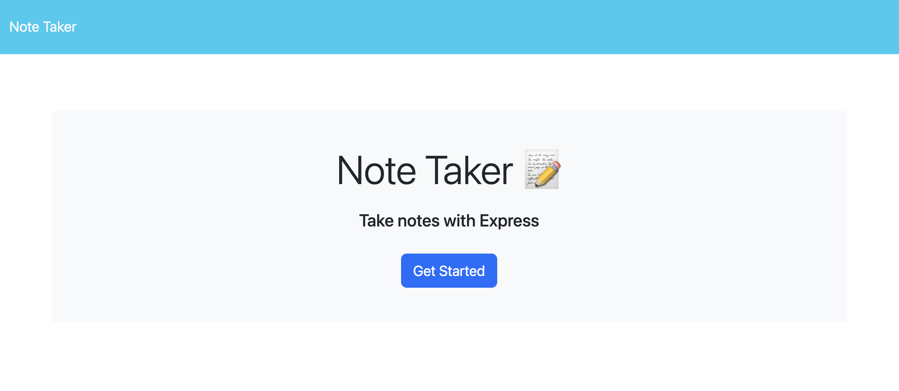
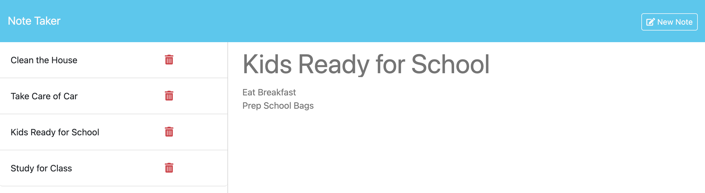
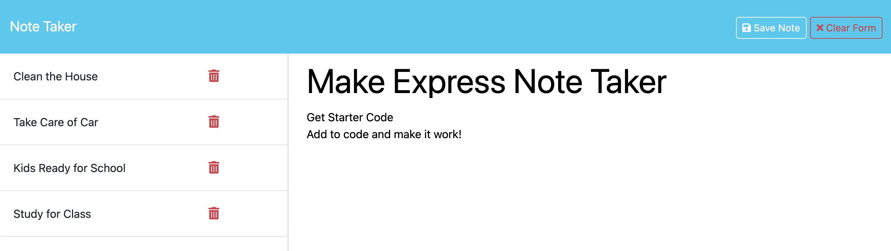

## Note Taker

[Note Taker](https://memosphere-a4428ea90189.herokuapp.com/)

## Description

The Note Taker is a simple web application that allows users to write, save, and delete notes. It provides a convenient way for small business owners or individuals to organize their thoughts, keep track of tasks, and manage important information.

**Features**

- **Create Notes**: Users can easily create new notes by entering a title and the note's text in the designated input fields.
- **Save Notes**: The application provides a "Save Note" button that allows users to save their newly created notes.
- **View Notes**: Existing notes are displayed in the left-hand column of the application's interface, providing users with quick access to their saved notes.
- **Delete Notes**: Users can delete unwanted notes by clicking on a delete button associated with each note in the list.

## Table of Contents

- [Note Taker](#note-taker) 
- [Description](#description) 
- [Table of Contents](#tabel-of-contents) 
- [User Story](#user-story) 
- [Acceptance Criteria](#acceptance-criteria) 
- [Installation](#installation) 
- [Development](#development) 
- [Usage](#usage) 
- [Technologies](Technologies)
- [License](#license) 
- [Contributing](#contributing) 
- [Tests](#tests) 
- [Resources](#resources) 
- [Questions/Contact](#questionscontact)

## User Story

**AS A** small business owner  

**I WANT** to be able to write and save notes  

**SO THAT** I can organize my thoughts and keep track of tasks I need to complete.

## Acceptance Criteria

**GIVEN** a note-taking application

**WHEN** I open the Note Taker 
**THEN** I am presented with a landing page with a link to a notes page

**WHEN** I click on the link to the notes page 
**THEN** I am presented with a page with existing notes listed in the left-hand column, plus empty fields to enter a new note title and the note’s text in the right-hand column

**WHEN** I enter a new note title and the note’s text 
**THEN** a "Save Note" button and a "Clear Form" button appear in the navigation at the top of the page

**WHEN** I click on the Save button 
**THEN** the new note I have entered is saved and appears in the left-hand column with the other existing notes and the buttons in the navigation disappear

**WHEN** I click on an existing note in the list in the left-hand column 
**THEN** that note appears in the right-hand column and a "New Note" button appears in the navigation

**WHEN** I click on the "New Note" button in the navigation at the top of the page 
**THEN** I am presented with empty fields to enter a new note title and the note’s text in the right-hand column and the button disappears

## Installation

To get started with the Note Taker application, follow these steps:

1. Clone the repository: `git clone https://github.com/TheOarsman/Express.js_Note_Taker.git`
2. Navigate to the project directory: `cd Express.js_Note_Taker`

3. Install dependencies: `npm install`

4. Start the server: `node server.js`

5. Access the application:
   - Open your web browser and go to `http://localhost:3000` to access the Note Taker application.

## Development

If you want to contribute to the development of the Note Taker application or customize it for your own needs, follow these steps:

1. Fork the repository:

   - Click the "Fork" button at the top right corner of the repository page on GitHub to create your own copy of the repository.

2. Clone your forked repository: `git clone https://github.com/TheOarsman/Express.js_Note_Taker.git`

3. Navigate to the project directory: `cd note-taker`

4. Install dependencies: `npm install`

5. Make your changes:

   - Modify the existing code or add new features as needed.
   - Ensure that your changes follow the coding standards and conventions used in the project.

6. Test your changes:

   - Run any necessary tests to ensure that your changes work as expected.
   - Use `npm test` if there are any tests included in the project.

7. Commit your changes: 
   `git add .` 
   `git commit -m "Your descriptive commit message"`

8. Push your changes to GitHub: `git push origin main`

9. Create a Pull Request:
   - Go to your forked repository on GitHub.
   - Click the "New Pull Request" button.
   - Provide a title and description for your pull request, explaining your changes.
   - Click the "Create Pull Request" button to submit your contribution for review.

## Usage

Use it!

## Technologies

## License

MIT License

Copyright 2024 TheCoolestGroupEVER!!!

Permission is hereby granted, free of charge, to any person obtaining a copy
of this software and associated documentation files (the "Software"), to deal
in the Software without restriction, including without limitation the rights
to use, copy, modify, merge, publish, distribute, sublicense, and/or sell
copies of the Software, and to permit persons to whom the Software is
furnished to do so, subject to the following conditions:

The above copyright notice and this permission notice shall be included in all
copies or substantial portions of the Software.

THE SOFTWARE IS PROVIDED "AS IS", WITHOUT WARRANTY OF ANY KIND, EXPRESS OR
IMPLIED, INCLUDING BUT NOT LIMITED TO THE WARRANTIES OF MERCHANTABILITY,
FITNESS FOR A PARTICULAR PURPOSE AND NONINFRINGEMENT. IN NO EVENT SHALL THE
AUTHORS OR COPYRIGHT HOLDERS BE LIABLE FOR ANY CLAIM, DAMAGES OR OTHER
LIABILITY, WHETHER IN AN ACTION OF CONTRACT, TORT OR OTHERWISE, ARISING FROM,
OUT OF OR IN CONNECTION WITH THE SOFTWARE OR THE USE OR OTHER DEALINGS IN THE
SOFTWARE.

## Contributing

If you would like to contribute to this project, feel free to fork the repository and submit pull requests with your changes. Before submitting a pull request, make sure to follow these guidelines:

**Code Style**: Adhere to the existing code style and formatting conventions.
**Testing**: Ensure that your changes are properly tested and do not introduce any regressions.
**Documentation**: Update the relevant documentation, including code comments and README.md file, to reflect your changes.
**Commit Messages**: Write clear and descriptive commit messages that explain the purpose of your changes.

Thank you for considering contributing to this project! Your help is greatly appreciated.

## Tests

None currently

## Resources

N/A

## Questions/Contact

**Feedback** 
If you have any questions, feedback, or encounter any issues while using this portfolio website, please don't hesitate to reach out. You can contact me directly via my Gmail (click badge below) or by opening an issue in the GitHub repository. Your feedback is invaluable and helps improve this project for everyone. Thank you for your support!

**Heinz Ulrich V**:

 

 

 
